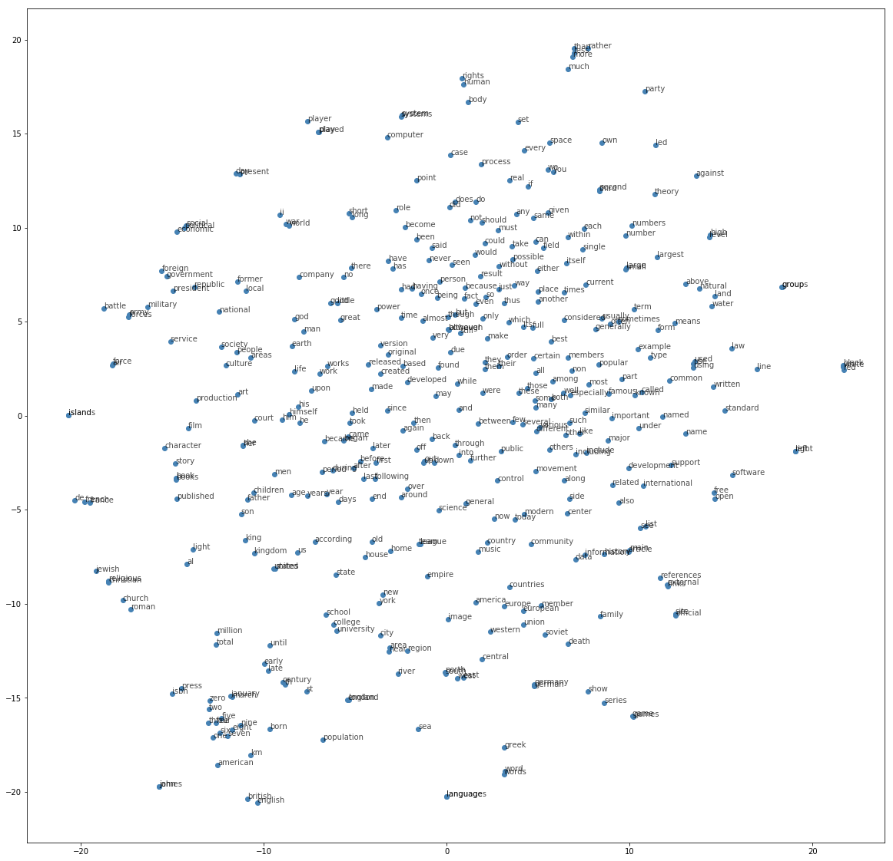

## Ex 3: Word2Vec ##
#### Autor: Paweł Kubik ####

### Preprocessing ###
Na samym początku działania algorytmu usuwałem z korpusu (zastępując ich wystąpienia tokenem unk) najczęstsze słowa oraz pojedyńcze litery:

```
['i', 'a', 'about', 'an', 'are', 'as', 'at', 'be', 'by', 'com', 'for', 'from', 'how', 'in', 'is', 'it', 'of', 'on', 'or', 'that', 'the', 'this', 'to', 'was', 'what', 'when', 'where', 'who', 'will', 'with', 'the', 'www'] + list('qwertyuiopasdfghjklzxcvbnm')
```

Słownik miał rozmiar ok. 63,588 słów, natomiast korpus 17,005,208.


### Ładowanie danych ###

Eksperymentowałem trochę z różnymi sposobami podawania danych do sieci ponieważ konsumowała ich spore ilości (batch miał rozmiar 10240 par słów,
przy wydajności ~60it/s), a mimo to zużycie mocy obliczeniowej GPU było znikome (~20%).

Dane dostarczałem z użyciem Datasetu, po wielu próbach najszybsza okazała się poniższa konfiguracja:

```
dataset = tf.data.Dataset.from_generator(
        lambda : batch(corpus, window_size, batch_size),
        (tf.int32, tf.int32),
        (tf.TensorShape([batch_size]), tf.TensorShape([batch_size, 1]))
    ).prefetch(10000)

def batch(corpus, window_size = 5, bs = 512):
    e = sample(corpus, window_size)
    while True:
        items = [next(e) for i in range(bs)]
        yield (np.array([i[0] for i in items]), np.array([i[1] for i in items]).reshape(len(items), 1))

def sample(corpus, window_size):
    while True:
        for i in range(len(corpus)):
            if corpus[i] != -1:
                for j in range(-window_size, window_size+1):
                    if j != 0 and 0 <= i+j < len(corpus) and corpus[i+j] != -1:
                        yield (corpus[i], corpus[i+j])
```

### Wyniki ###

Przeprowadziłem testy, eksperymentując z parametrami modelu, poniżej przedstawiam wyniki:

| lp | maks. gensim | maks. acc. | nr epoki | optimizer | embedding size | window size | szczegóły | uwagi |
| 1 | 2076 | 16.92% | 36 | AdamOptimizer(0.01) | 50 | 5 | rzadkie słowa usunięte z korpusu | - |
| 2 | 2316 | 18.88% | 7 | AdamOptimizer(0.001) | 60 | 8 | rzadkie słowa zastąpione symbolem unk | - |
| 3 | 382 | 3.11% | 52 | AdamOptimizer(0.001) | 50 | 5 | rzadkie słowa zastąpione symbolem unk | model się nie uczył -> rosnący loss |
| 4 | 2315 | 18.87% | 16 | AdamOptimizer(0.001) | 50 | 5 | rzadkie słowa zastąpione symbolem unk | model był za słaby i od 6 epoki praktycznie się nie uczył |
| 5 | 2402 | 19.58% | 41 | AdamOptimizer with exponential decay (start=0.005, 0.82/20000) | 50 | 5 | rzadkie słowa zastąpione symbolem unk | - |


*Wizaulizacja 400 najczęstszych słów*

### Referencje ###
- Tomas Mikolov, Kai Chen, Greg Corrado, Jeffrey Dean, "Efficient Estimation of Word Representations in Vector Space", arXiv:1301.3781 [cs.CL], Sep 2013
- https://www.ranks.nl/stopwords
- Vector Representations of Words. Retrieved from https://www.tensorflow.org/tutorials/word2vec
